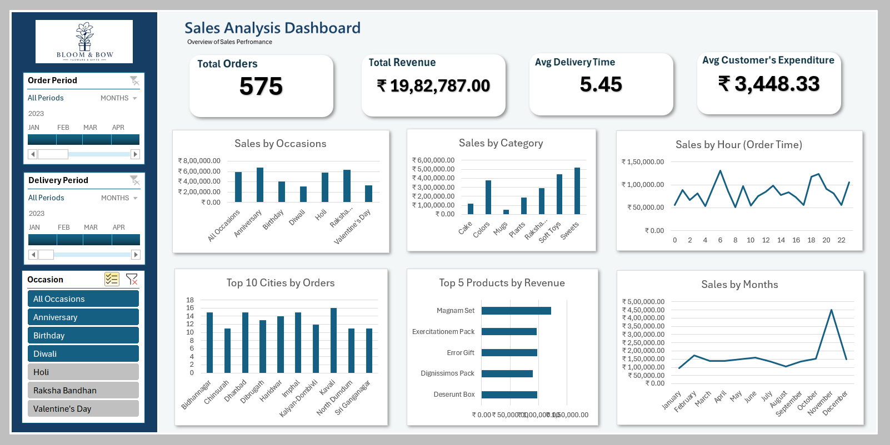

# 📑Sales & Customer Analytics Dashboard

An end-to-end Excel analytics project built for a gifting company that ships products for occasions like Diwali, Raksha Bandhan, Holi, Valentine's Day, Birthdays, and Anniversaries. The project analyzes order data of one year to uncover sales trends, customer spending behavior, delivery performance, and product-level insights that support sharper sales and inventory decisions.

## 1. Project Overview

The company had three disconnected datasets — customers, orders, and products — with no unified view of performance. This project cleans, models, and connects that data in Excel to answer ten core business questions: total revenue, delivery performance, monthly sales trends, top-performing products, customer spending patterns, city-wise order volume, the relationship between order quantity and delivery time, revenue by occasion, and product popularity by occasion.

The output is a single interactive dashboard that lets stakeholders filter by month, occasion, and city, and instantly see how the business is performing.

**Headline numbers from the analysis:**
- 💰 Total Revenue: **₹35,20,984** across 1,000 orders
- 📦 Average Order Value: **₹3,521**
- 🚚 Average Delivery Time: **~5.5 days**
- 🎁 Average Quantity per Order: **~3 units**

## 2. Key Features

- **Interactive dashboard** with slicers and a date timeline for dynamic filtering by month, occasion, and city
- **KPI cards** for total revenue, average order value, and average delivery time
- **Monthly sales trend** visualization across 2023
- **Top revenue-generating products** and top 5 product performance tracking
- **Top 10 cities** ranked by order volume
- **Order quantity vs. delivery time** analysis to test whether larger orders take longer to fulfill
- **Revenue comparison across occasions** (Diwali, Raksha Bandhan, Holi, Valentine's Day, Birthdays, Anniversaries)
- **Product popularity by occasion**, highlighting which products drive sales for specific events
- **Relational data model** built with Power Pivot, linking customers, orders, and products through Customer_ID and Product_ID
- **Derived fields** for delivery duration, order hour, weekday, and revenue, calculated using DAX and formulas

## 3. Tools and Tech Used

- **Microsoft Excel** — core analysis and dashboard environment
- **Power Pivot** — data modeling and relationships across tables
- **DAX** — calculated columns and measures (e.g., delivery time, revenue)
- **Pivot Tables & Pivot Charts** — aggregation and visualization
- **Slicers & Timelines** — interactive filtering
- **Power Query / Data Cleaning** — handling inconsistent and raw source data

## 4. Dataset Overview

Three linked tables covering annual activity: **Customers** (~100 records: ID, name, city, contact details), **Orders** (~1,000 records: order and delivery dates/times, quantity, occasion, revenue), and **Products** (~70 records: product name, category, price, associated occasion).

## 5. Project Workflow

1. **Data Collection** — Gathered raw customer, order, and product data
2. **Data Cleaning** — Standardized formats, handled missing values, and fixed inconsistent entries
3. **Data Modeling** — Built table relationships in Power Pivot using Customer_ID and Product_ID as keys
4. **Feature Engineering** — Created calculated columns for delivery duration, order hour, weekday, and revenue
5. **Analysis** — Used Pivot Tables to answer each of the ten business questions
6. **Visualization** — Designed charts and KPI cards for each insight
7. **Dashboard Assembly** — Combined visuals into a single interactive dashboard with slicers and a timeline filter
8. **Insight Generation** — Interpreted results to surface actionable trends for the business

## 6. Screenshot

---

### Notes

- This project was built for skill demonstration and portfolio purposes. Customer and order data used here is synthetic/sample data generated for practice and does not represent real individuals or transactions.
- The workbook includes an `Analysis` sheet used as the working/staging area for pivot tables and calculations behind the dashboard. The `Dashboard` sheet is the final consolidated view intended for end users.

---
